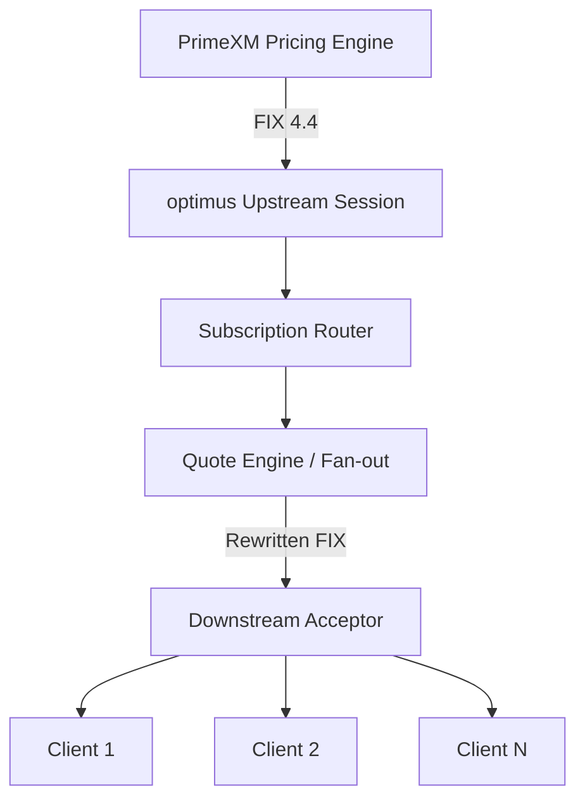

# optimus: PrimeXM-Compatible FIX Market Data Gateway

**optimus** is a high-performance, FIX 4.4-native market data gateway and splitter designed specifically for PrimeXM pricing streams. It allows multiple downstream consumers to share a single canonical upstream PrimeXM pricing session, reducing costs and operational complexity.

## Key Features

- **Single Upstream Session**: Consolidates all downstream subscriptions into one upstream session.
- **Low Latency**: Custom zero-allocation FIX parser/serializer for sub-millisecond internal fan-out latency.
- **Protocol Transparent**: Automatically rewrites `302` (QuoteSetID) to each client's unique `262` (MDReqID).
- **Production Ready**: Includes Prometheus metrics, robust stream scanning, and slow-client isolation.
- **PrimeXM Compliant**: Native support for `141=Y` session resets, periodic `35=W` snapshots, and `35=b` acknowledgements.

## Architecture



## Quick Start

### Installation

```bash
go get github.com/youruser/optimus
```

### Configuration

Create a `config.yaml` in the root directory:

```yaml
upstream_host: "pricing.primexm.com"
upstream_port: 9879
upstream_user: "your_user"
upstream_pass: "your_pass"
listen_addr: "0.0.0.0:9878"
```

Set via Environment Variables:

```bash
export optimus_UPSTREAM_USER="your_user"
export optimus_UPSTREAM_PASS="your_pass"
```

### Running

```bash
go run cmd/gateway/main.go
```

## Observability

optimus exposes Prometheus metrics on `:9090/metrics`:

- `fix_gateway_upstream_session_state`: Current state of the PrimeXM session.
- `fix_gateway_downstream_sessions_active`: Number of connected clients.
- `fix_gateway_upstream_ticks_total`: Inbound data rate per symbol.
- `fix_gateway_slow_client_drops_total`: Messages dropped due to slow client buffers.

## License

MIT - See [LICENSE](LICENSE) for details.
